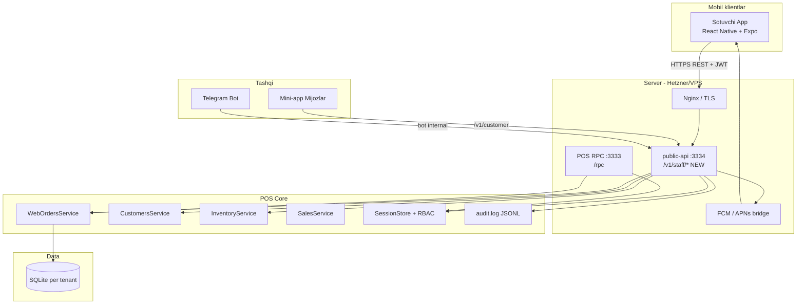
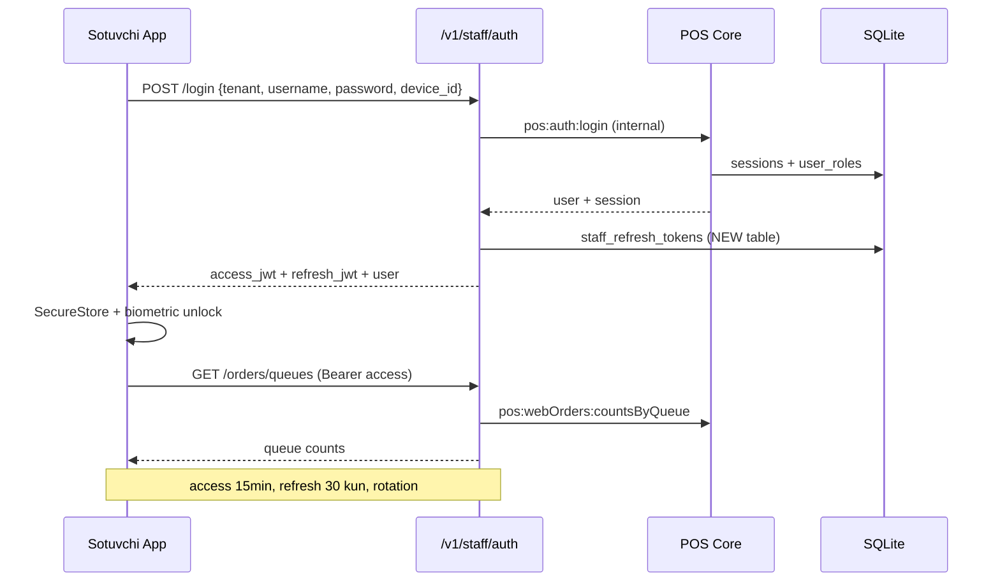

# Sotuvchilar mobil ilovasi — arxitektura va rejа

> **Holat:** Phase 1–2 — tasdiqlash uchun  
> **Maqsad:** DunyoZamin POS ekotizimida sotuvchilar (field sales, onlayn buyurtma operatorlari, kuryer menejerlari) uchun alohida, enterprise darajasidagi mobil ilova.

---

## 1. Mahsulot ko‘rinishi (Product vision)

**Sotuvchi ilovasi nima qiladi?**

Sotuvchi — do‘kondagi kassir emas, balki **maydondagi xodim**: Telegram marketplace buyurtmalarini qabul qiladi, tayyorlaydi, kuryerga uzatadi; mijoz bilan bog‘lanadi; kerak bo‘lsa qoldiq va narxni tez tekshiradi.

| Foydalanuvchi | Asosiy vazifa | Ilova yordamida |
|---------------|---------------|-----------------|
| **Onlayn buyurtma operatori** | `web_orders` navbatlari | Yangi → Tayyorlanmoqda → Tayyor → Kuryerga |
| **Field sotuvchi** | Mijoz bilan uchrashuv | Mijoz qidirish, qoldiq, tez savdo (v2) |
| **Kuryer menejeri** | Yetkazib berish | Tayyor buyurtmalarni kuryerga yuborish, holat yangilash |
| **Do‘kon menejeri** | Nazorat | Navbat sonlari, kunlik onlayn savdo (cheklangan hisobot) |

**Mijoz mini-app (`app.dunyozamin.com`) dan farqi:** mini-app xaridorlar uchun; bu ilova **xodimlar** uchun, POS sessiyasi va RBAC bilan.

---

## 2. Mavjud tizim tahlili

### 2.1 Mini-app (mijozlar)

- **Stack:** React 18 + Vite + Tailwind, Telegram WebApp
- **API:** `public-api` `/v1/*` — Telegram `initData` → JWT (access + refresh)
- **Auth sub:** `marketplace_customers` (mijoz ID)
- **Funksiya:** katalog, savat, checkout, buyurtmalar tarixi

### 2.2 Admin SPA + Electron POS

- **Admin:** React SPA → `remotePosApi.ts` → HTTP `POST /rpc` (:3333)
- **Auth:** `pos:auth:login` → opaque session token (12 soat TTL, refresh yo‘q)
- **RBAC** (`rpcDispatch.cjs`):
  - `admin` — hamma narsa
  - `manager` — admin-only kanallardan tashqari hammasi
  - `cashier` — savdo, qaytarish, smena, mijozlar; **webOrders yo‘q**

### 2.3 Web buyurtmalar oqimi (allaqachon bor)

```
new/paid → processing → ready → out_for_delivery → delivered
                              ↘ delivered (pickup)
         ↘ cancelled (har bosqichda)
```

- **Navbatlar:** `incoming`, `preparing`, `ready`, `delivering`, `delivered` (`webOrderQueues.cjs`)
- **Backend:** `WebOrdersService` — stock fulfillment, Telegram xabarnoma, kuryer guruhiga yuborish
- **RPC kanallar:** `pos:webOrders:list|get|updateStatus|update|cancel|dispatchToCourier|countsByQueue|reportSummary`
- **Admin UI:** `src/pages/WebOrders.tsx` — to‘liq desktop jadval

### 2.4 Public-api bot routes

- Telegram admin bot orqali buyurtma holati (internal secret)
- Mijoz auth bilan aralashmasligi kerak

### 2.5 Xulosa — qayta ishlatish mumkin

| Komponent | Qayta ishlatish |
|-----------|-----------------|
| `WebOrdersService` | ✅ To‘liq |
| `webOrderStatusFlow.cjs` | ✅ Shared logic |
| `webOrderQueues.cjs` | ✅ Shared logic |
| `remotePosApi` RPC pattern | ⚠️ MVP uchun; mobile uchun REST qoplamasi yaxshiroq |
| `public-api` mijoz JWT | ❌ Staff uchun emas |
| Mini-app UI | ❌ Mijoz UX; copy qilmaslik |

---

## 3. Funksiyalar — MVP vs v2

### MVP (8–10 hafta, 1 dev + 0.5 backend)

| # | Funksiya | Tavsif |
|---|----------|--------|
| 1 | **Kirish** | Tenant slug + login/parol, biometrik qayta ochish |
| 2 | **Navbatlar dashboard** | 5 ta navbat badge + sonlar (`countsByQueue`) |
| 3 | **Buyurtmalar ro‘yxati** | Filtr, qidiruv, pull-to-refresh |
| 4 | **Buyurtma tafsiloti** | Mijoz, manzil, to‘lov, qatorlar, eslatma |
| 5 | **Holat yangilash** | Ruxsat etilgan o‘tishlar (`allowedNextStatuses`) |
| 6 | **Kuryerga yuborish** | `dispatchToCourier` (courier delivery) |
| 7 | **Bekor qilish** | Sabab bilan |
| 8 | **Push bildirishnomalar** | Yangi buyurtma, navbat o‘zgarishi (FCM) |
| 9 | **i18n** | uz / ru / en |
| 10 | **Offline ko‘rish** | Oxirgi sync qilingan navbatlar (read-only cache) |

### v2 (keyingi 6–8 hafta)

| # | Funksiya |
|---|----------|
| 1 | Mijoz qidirish + balans/kontakt |
| 2 | Mahsulot qidirish + qoldiq (`inventory:getCurrentStock`) |
| 3 | Tez savdo (soddalashtirilgan savat, naqd/plastik) |
| 4 | Kuryer rejimi — faqat `out_for_delivery` buyurtmalar, GPS (ixtiyoriy) |
| 5 | Kunlik onlayn savdo hisoboti |
| 6 | To‘liq offline queue (holat o‘zgarishlari sync) |
| 7 | Barkod skaner |
| 8 | MDM / remote wipe (enterprise) |

### MVP dan tashqari (v3+)

- Field CRM (uchrashuvlar, eslatmalar)
- Multi-do‘kon tanlash
- Voice call integratsiya
- Apple Watch / Wear OS quick actions

---

## 4. Arxitektura diagrammasi



### Auth oqimi (mobil)



---

## 5. API strategiyasi

### Tavsiya: **`/v1/staff/*` — public-api ga yangi modul**

**Nima uchun yangi REST qatlam?**

| Yondashuv | Afzallik | Kamchilik |
|-----------|----------|-----------|
| To‘g‘ridan-to‘g‘ri RPC | Tez MVP, mavjud kanallar | Mobile uchun noqulay; refresh yo‘q; har channel alohida |
| Faqat public-api kengaytirish | Bitta port, CORS | Mijoz/staff aralashmasligi uchun namespace kerak |
| **Staff REST + ichki RPC** ✅ | Mobile-friendly, JWT refresh, audit, versioning | ~2 hafta backend ish |

### Endpointlar (MVP)

```
POST   /v1/staff/auth/login
POST   /v1/staff/auth/refresh
POST   /v1/staff/auth/logout
POST   /v1/staff/devices/register          # FCM token

GET    /v1/staff/me
GET    /v1/staff/orders/queues              # countsByQueue
GET    /v1/staff/orders?queue=&page=&q=
GET    /v1/staff/orders/:id
PATCH  /v1/staff/orders/:id/status         # { status, reason? }
POST   /v1/staff/orders/:id/dispatch-courier
POST   /v1/staff/orders/:id/cancel         # { reason }

GET    /v1/staff/customers/search?q=       # v2
GET    /v1/staff/products/search?q=        # v2
GET    /v1/staff/inventory/:productId      # v2
```

**Ichki amalga oshirish:** har route `WebOrdersService` / RPC dispatcher orqali — biznes logika dublikatsiya qilinmaydi.

### RBAC o‘zgarishlari (backend)

Yangi rol: **`sales`** (yoki mavjud `manager` ni kengaytirish — tavsiya: alohida rol)

```javascript
// rpcDispatch.cjs ga qo'shiladi
sales: (ch) =>
  ch.startsWith('pos:webOrders:') ||
  ch.startsWith('pos:customers:') && !ch.includes(':delete') ||
  ch.startsWith('pos:products:') && ch.endsWith(':list') ||
  ch.startsWith('pos:inventory:getCurrentStock') ||
  ch === 'pos:auth:me' || ch === 'pos:auth:logout' ||
  ch === 'pos:health' || ch === 'pos:appConfig:get'
```

### Push bildirishnomalar

1. `staff_devices` jadvali: `user_id`, `device_id`, `fcm_token`, `platform`
2. Yangi `web_orders` INSERT/ status change → queue worker → FCM
3. Mavjud `telegramNotify.cjs` bilan parallel (xodimlar Telegram emas, native app)

---

## 6. Texnologiya tanlovi

### Tavsiya: **React Native + Expo (SDK 52+)**

| Variant | Baholash | Sabab |
|---------|----------|-------|
| **React Native + Expo** ✅ | 9/10 | FCM, biometric, SecureStore, OTA updates, jamoa React biladi |
| PWA (Vite) | 5/10 | iOS push cheklangan, offline zaif, App Store yo‘q |
| Capacitor + admin SPA | 4/10 | Desktop UI mobilga mos emas, og‘ir |
| Flutter | 7/10 | Yaxshi, lekin stack React — qayta o‘qitish |
| Mini-app kengaytirish | 2/10 | Mijoz + xodim aralashadi, Telegram bog‘liqlik |

### Mobil stack

| Qatlam | Texnologiya |
|--------|-------------|
| Framework | Expo Router (file-based nav) |
| UI | NativeWind (Tailwind) yoki React Native Paper |
| State | Zustand + TanStack Query |
| Auth storage | expo-secure-store |
| Biometric | expo-local-authentication |
| Push | expo-notifications + FCM |
| Offline | TanStack Query persist + MMKV |
| i18n | i18next (admin `src/locales/*` dan import) |
| API client | fetch + auto refresh (mini-app `api.ts` pattern) |

---

## 7. Enterprise talablar checklist

| Talab | MVP | Reja |
|-------|-----|------|
| JWT access + refresh rotation | ✅ | `staff_refresh_tokens` jadval |
| RBAC (`sales` roli) | ✅ | `rpcDispatch` + route middleware |
| Multi-tenant | ✅ | `tenant` header/body, mavjud `mtDispatch` |
| Audit log | ✅ | Har PATCH → `audit.record('staff_order_status', ...)` |
| Rate limiting | ✅ | Mavjud `express-rate-limit` |
| i18n uz/ru/en | ✅ | Admin locale fayllaridan shared keys |
| Secure token storage | ✅ | Keychain / Keystore |
| Biometric re-auth | ✅ | App foreground |
| Offline read cache | ✅ | SQLite/MMKV |
| Offline write sync | v2 | Outbox pattern |
| Error tracking | ✅ | Sentry |
| E2E tests | v2 | Detox / Maestro |
| MDM / app config | v3 | Expo Updates channels |

---

## 8. Papka strukturasi

```
app01/
├── docs/
│   └── SALES-MOBILE-ARCHITECTURE.md    ← bu hujjat
├── sales-mobile/                        ← YANGI mobil ilova
│   ├── app/                             # Expo Router screens
│   │   ├── (auth)/login.tsx
│   │   ├── (tabs)/                      # orders, profile
│   │   └── orders/[id].tsx
│   ├── src/
│   │   ├── api/                         # staff REST client
│   │   ├── auth/                        # session, biometric
│   │   ├── hooks/
│   │   ├── i18n/
│   │   ├── stores/
│   │   └── types/                       # web order types (shared)
│   ├── app.json
│   └── package.json
├── public-api/
│   ├── routes/staff/                    ← YANGI (keyingi bosqich)
│   │   ├── auth.cjs
│   │   └── orders.cjs
│   └── lib/staffJwt.cjs
└── shared/                              ← ixtiyoriy (v2)
    └── webOrderTypes.ts
```

---

## 9. Vaqt rejasi (taxminiy)

| Faza | Davomiylik | Natija |
|------|------------|--------|
| **0. Tasdiqlash** | 1 hafta | Ushbu hujjat + dizayn mockup |
| **1. Backend staff API** | 2–3 hafta | `/v1/staff/*`, `sales` roli, FCM register |
| **2. Mobil MVP core** | 3–4 hafta | Login, navbatlar, buyurtma, holat |
| **3. Push + offline cache** | 1–2 hafta | FCM, MMKV cache |
| **4. QA + beta** | 1–2 hafta | TestFlight / Internal testing |
| **5. v2 features** | 6–8 hafta | Mijoz, qoldiq, tez savdo |

**Jami MVP:** ~8–10 hafta (1 full-stack + qisman dizayn)

---

## 10. Murakkablik va xarajat bahosi

| Omil | Baho | Izoh |
|------|------|------|
| Backend staff API | **O‘rta** | Mavjud servislar bor; JWT refresh yangi |
| Mobil ilova | **O‘rta-yuqori** | RN tajribasi kerak |
| Push infra | **Past** | FCM bepul; APNs sertifikat |
| Offline sync (v2) | **Yuqori** | Conflict resolution |
| App Store / Play | **Past** | Expo EAS Build |
| Xavfsizlik audit | **O‘rta** | Pen-test tavsiya etiladi |

**Xavf nuqtalari:**
1. `cashier` roli hozir `webOrders` ga kira olmaydi — yangi `sales` roli yaratish shart
2. Staff session refresh hozir yo‘q — mobil uchun JWT qatlami kerak
3. FCM + multi-tenant: har tenant alohida push topic yoki user-based token

---

## 11. Keyingi qadamlar (tasdiqlashdan keyin)

1. ✅ Ushbu hujjatni tasdiqlash
2. Figma mockup: Login, Navbatlar, Buyurtma detali (3 ekran)
3. Backend: `public-api/routes/staff/` + migration `085_staff_refresh_tokens.sql`
4. `sales-mobile` Expo loyihasini to‘liq scaffold
5. EAS Build + internal distribution

---

*Yaratilgan: 2026-05-24 | Versiya: 0.1-draft*
